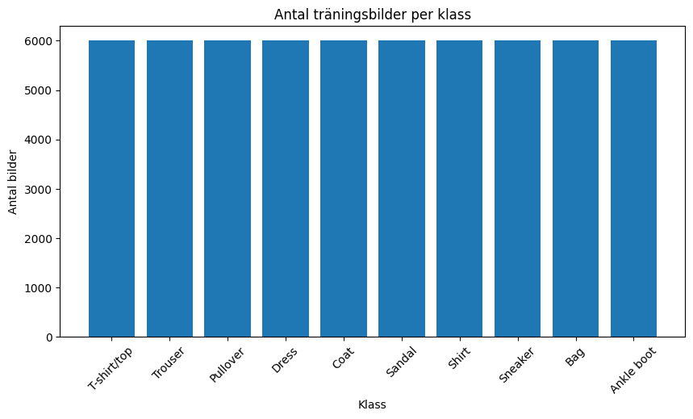
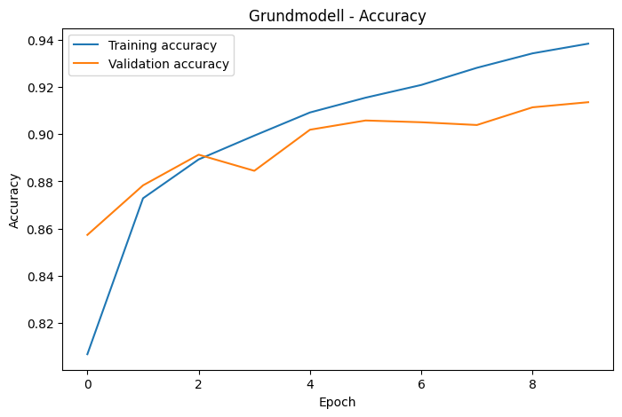
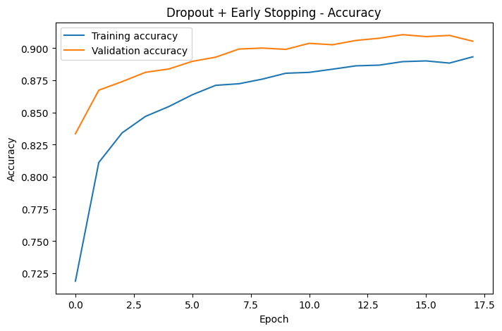

# Fashion MNIST – Undersökning av regularisering i CNN-modeller

## 1. Inledning

I den här uppgiften har jag byggt och testat en modell för bildklassificering med hjälp av deep learning. Målet var att skapa en modell som kan avgöra vilken kategori ett klädesplagg tillhör utifrån en bild. För detta användes datasetet Fashion MNIST, som innehåller bilder av olika typer av kläder och skor.

Utöver att bygga en fungerande modell skulle uppgiften också innehålla en fördjupning inom ett specifikt område av deep learning. Jag valde att fokusera på regularisering, eftersom jag ville undersöka hur olika tekniker påverkar modellens förmåga att generalisera och hur de kan användas för att minska risken för overfitting.

Eftersom jag genomförde uppgiften själv istället för i grupp har resultaten sammanställts i denna rapport istället för att presenteras muntligt.

## 2. Dataset

För projektet användes Fashion MNIST, ett dataset som innehåller gråskalebilder i storleken 28x28 pixlar. Datasetet består av totalt 70 000 bilder fördelade på 10 olika kategorier av klädesplagg och accessoarer.

De kategorier som ingår är:

* T-shirt/top
* Trouser
* Pullover
* Dress
* Coat
* Sandal
* Shirt
* Sneaker
* Bag
* Ankle boot

Datasetet är uppdelat i 60 000 träningsbilder och 10 000 testbilder.

Innan arbetet med modellen påbörjades undersökte jag hur datan var fördelad mellan de olika klasserna. Resultatet visade att samtliga kategorier innehöll ungefär lika många bilder. Datasetet kan därför betraktas som balanserat, vilket är en fördel eftersom modellen inte riskerar att gynna vissa klasser enbart på grund av att de förekommer oftare i träningsdatan.

### Klassfördelning

### Kommentar om datakällan

Enligt uppgiftsbeskrivningen skulle Fashion MNIST laddas via Keras. När jag försökte göra detta uppstod dock ett fel eftersom Googles lagringsserver, som TensorFlow använder för att hämta datasetet, inte var tillgänglig från min nuvarande plats i Iran. Felmeddelandet som returnerades var:

*"We're sorry, but this service is not available in your location."*

Jag testade även att hämta datasetet via OpenML men stötte där på tekniska problem vid nedladdningen.

För att kunna genomföra uppgiften användes därför Fashion MNIST från det officiella GitHub-repot för datasetet. Datasetets innehåll, etiketter och struktur är identiska med den version som normalt laddas via Keras. Skillnaden ligger endast i hur filerna hämtades.

## 3. Datapreparering

Innan modellen kunde tränas behövde datan förberedas.

Först normaliserades alla bilder genom att dividera pixelvärdena med 255. Ursprungligen hade varje pixel ett värde mellan 0 och 255, men efter normaliseringen låg värdena mellan 0 och 1. Detta är en vanlig metod inom deep learning eftersom det gör träningen mer stabil.

Därefter formaterades bilderna om för att passa en CNN-modell. Fashion MNIST består av gråskalebilder med storleken 28x28 pixlar. För att CNN-modellen skulle kunna tolka bilderna lades en kanal-dimension till, vilket gav formatet (28, 28, 1).

## 4. Grundmodell

Som utgångspunkt skapades en enkel CNN-modell.

Modellen bestod av två konvolutionslager (Conv2D), två poolinglager (MaxPooling2D) samt två fullt anslutna lager (Dense). ReLU användes som aktiveringsfunktion i de dolda lagren och Softmax användes i det sista lagret för att kunna klassificera bilderna i någon av de tio klasserna.

Modellen tränades i 10 epoker med Adam som optimerare och Sparse Categorical Crossentropy som förlustfunktion.

Resultatet blev en test accuracy på 90,82 %, vilket visade att modellen redan från början presterade relativt bra på uppgiften.

### Accuracy för grundmodellen

## 5. Fokusområde: Regularisering

Fokusområdet för denna uppgift var regularisering.

Regularisering används för att minska risken för overfitting. Overfitting uppstår när modellen lär sig träningsdatan alltför väl och därmed får svårare att prestera på ny data som den inte har sett tidigare.

I projektet testades två olika regulariseringstekniker:

* Dropout
* Early Stopping

För att kunna jämföra effekten av dessa tekniker skapades tre olika modeller:

1. Grundmodell utan regularisering
2. Modell med Dropout
3. Modell med Dropout och Early Stopping

Syftet var att undersöka hur dessa förändringar påverkade modellens resultat och generaliseringsförmåga.

## 6. Resultat

Efter att samtliga modeller hade tränats jämfördes deras resultat på testdatan.

| Modell                   | Test Accuracy |
| ------------------------ | ------------- |
| Grundmodell              | 90,82 %       |
| Dropout                  | 89,53 %       |
| Dropout + Early Stopping | 90,14 %       |

Grundmodellen gav det högsta resultatet av de tre modellerna.

Modellen med Dropout fick något lägre accuracy än grundmodellen. Detta var dock inte särskilt oväntat eftersom Dropout medvetet gör träningen svårare genom att tillfälligt stänga av vissa neuroner under träningen.

När Early Stopping kombinerades med Dropout förbättrades resultatet jämfört med modellen som endast använde Dropout. Träningen stoppades dessutom automatiskt efter 18 epoker trots att den maximalt tillåtna träningslängden var satt till 30 epoker.

### Accuracy för modellen med Dropout och Early Stopping

## 7. Analys

När jag jämförde resultaten blev det tydligt att regularisering inte automatiskt leder till högre accuracy.

Min ursprungliga tanke var att modellen med mest regularisering skulle prestera bäst, men resultaten visade att verkligheten är mer nyanserad än så. Grundmodellen uppnådde faktiskt den högsta accuracy-nivån trots att den saknade både Dropout och Early Stopping.

Samtidigt kunde jag se att skillnaden mellan träningsresultat och valideringsresultat blev mindre i de regulariserade modellerna. Detta tyder på att modellerna blev mindre benägna att överanpassa sig till träningsdatan.

En intressant observation var att Early Stopping avslutade träningen redan efter 18 epoker. Det visar att modellen hade nått en punkt där ytterligare träning inte längre gav någon tydlig förbättring på valideringsdatan. På så sätt sparas både tid och beräkningsresurser samtidigt som risken för overfitting minskar.

Utifrån resultaten skulle jag därför säga att den viktigaste lärdomen från projektet är att regularisering handlar mer om generalisering och robusthet än om att maximera accuracy i varje enskild körning.

## 8. Slutsats

Syftet med uppgiften var att bygga en fungerande modell för bildklassificering och samtidigt fördjupa sig inom ett område av deep learning.

Jag valde att fokusera på regularisering och testade tre olika varianter av modellen:

1. En grundmodell utan regularisering
2. En modell med Dropout
3. En modell med Dropout och Early Stopping

Samtliga modeller presterade bra och uppnådde en test accuracy på ungefär 90 %.

Resultaten visade att grundmodellen gav den högsta accuracy-nivån, men att de regulariserade modellerna hade egenskaper som kan vara värdefulla i större och mer komplexa projekt där risken för overfitting är större.

Projektet gav mig en bättre förståelse för hur regularisering fungerar i praktiken och hur olika tekniker kan påverka en modells beteende. Jag fick även en tydligare bild av att högst accuracy inte alltid är det enda måttet som är viktigt när man utvärderar en modell.

## 9. Källor

TensorFlow Documentation
https://www.tensorflow.org/

Keras Documentation
https://keras.io/

Fashion MNIST Dataset
https://github.com/zalandoresearch/fashion-mnist

Scikit-learn Documentation
https://scikit-learn.org/
